<div align="center">

# 🏁 MISSION CONTROL — F1 Kinetic Command

### A deep, *Football Manager*–style Formula 1 team-principal simulation for the web.

**Command your constructor. Build your legacy.**

[](https://nextjs.org/)
[](https://react.dev/)
[](https://www.typescriptlang.org/)
[](https://tailwindcss.com/)
[](https://github.com/pmndrs/zustand)
[](https://vitest.dev/)


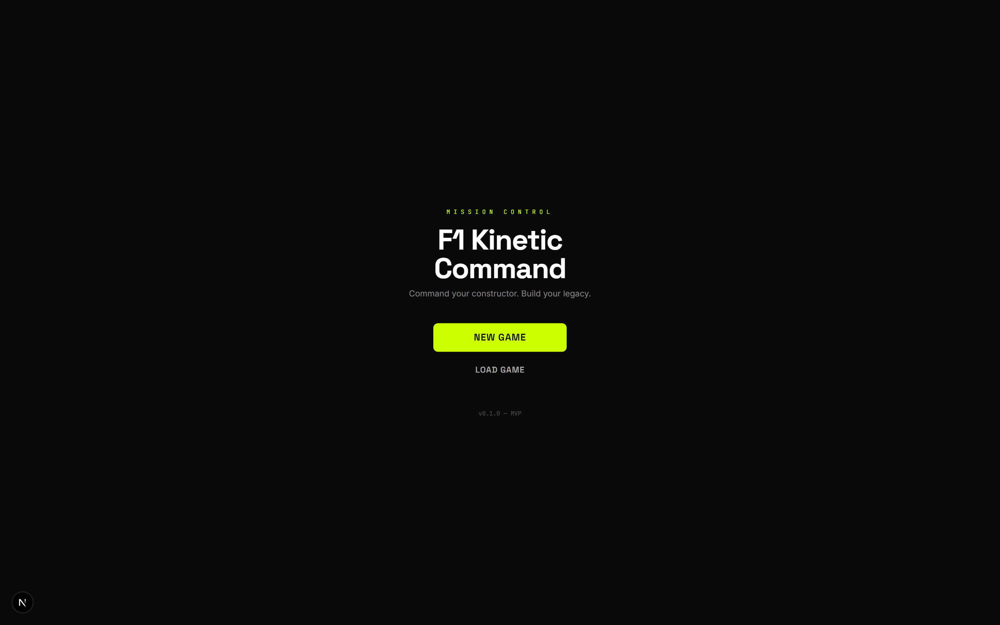

</div>

---

## Overview

**Mission Control: F1 Kinetic Command** is a high-fidelity Formula 1 management simulation built for enthusiasts who want the strategic depth of *Football Manager* applied to F1. You take the role of **Team Principal** of one of eleven constructors and steer it through full seasons — making decisions across R&D, driver management, race strategy, sponsorships, finance, and regulations.

Every screen is designed as a high-tech telemetry **command center**. The guiding philosophy is **"Signal over Noise"**: deep simulation surfaced through a sleek, broadcast-inspired interface with progressive disclosure — never a spreadsheet.

The simulation is grounded in the **2026 F1 regulation reset** (1.6L V6 turbo-hybrid, 50/50 ICE/electric split, no MGU-H, active aerodynamics, sustainable fuels) and the **real 2026 grid** of 11 teams and 22 drivers. Race physics are calibrated against **real telemetry data** (tire degradation, pit-loss, stint lengths, and per-circuit characteristics) sourced from the OpenF1 dataset across 24 circuits.

> ⚡ **100% client-side.** The entire game — simulation engine, save system, and AI — runs in your browser. No backend, no account, no servers. Saves persist locally to IndexedDB.

---

## Table of Contents

- [The Interface — A Visual Tour](#the-interface--a-visual-tour)
- [Live Race Simulation](#live-race-simulation)
- [Feature Deep Dive](#feature-deep-dive)
- [The 2026 Grid](#the-2026-grid)
- [Starting Scenarios](#starting-scenarios)
- [The Race Weekend Loop](#the-race-weekend-loop)
- [Architecture](#architecture)
- [Tech Stack](#tech-stack)
- [Getting Started](#getting-started)
- [Project Structure](#project-structure)
- [Testing & Quality](#testing--quality)
- [Design System — "Kinetic Command"](#design-system--kinetic-command)
- [Roadmap & Status](#roadmap--status)
- [Disclaimer](#disclaimer)

---

## The Interface — A Visual Tour

### 1. Choose Your Constructor

Start a new season by picking one of **11 fully-modelled teams** with their real 2026 driver lineups and power-unit suppliers.

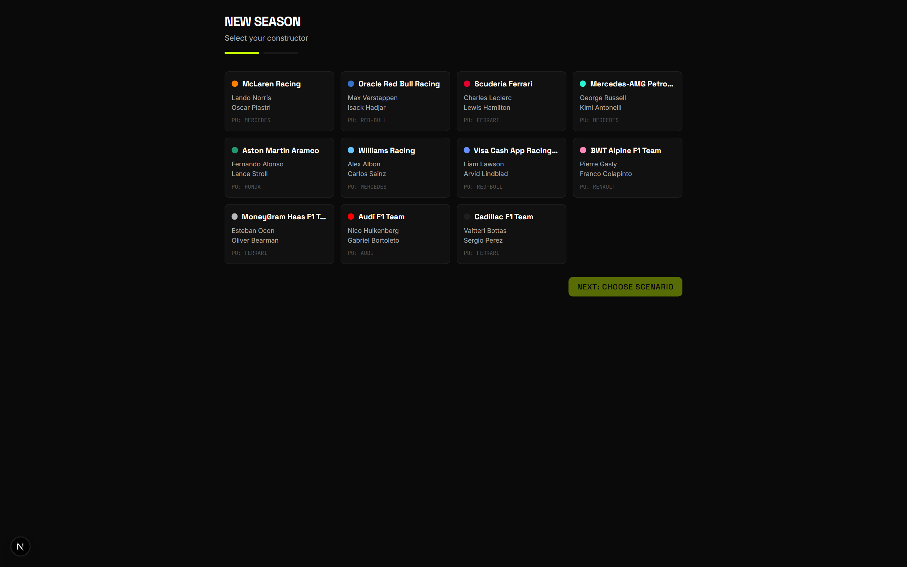

### 2. Pick a Scenario

Each team can be played under different **difficulty scenarios** — from defending a championship dynasty to dragging a brand-new entrant up the grid. Scenarios modify your budget, car performance, morale, prestige, and the board's expectations of you.

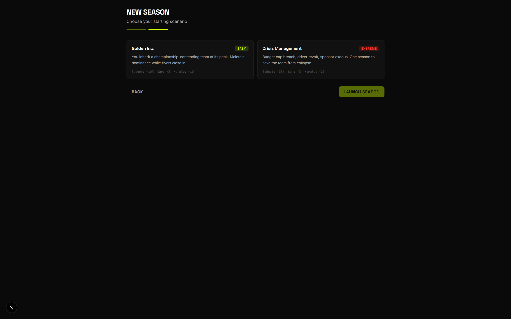

### 3. The Paddock — Command Dashboard

Your home base. Race countdown, team health, driver morale + form, the constructors' championship, the **paddock rumor feed**, **engineer recommendations**, your weekly schedule, and your **board objectives** (the season mandate that can get you sacked).

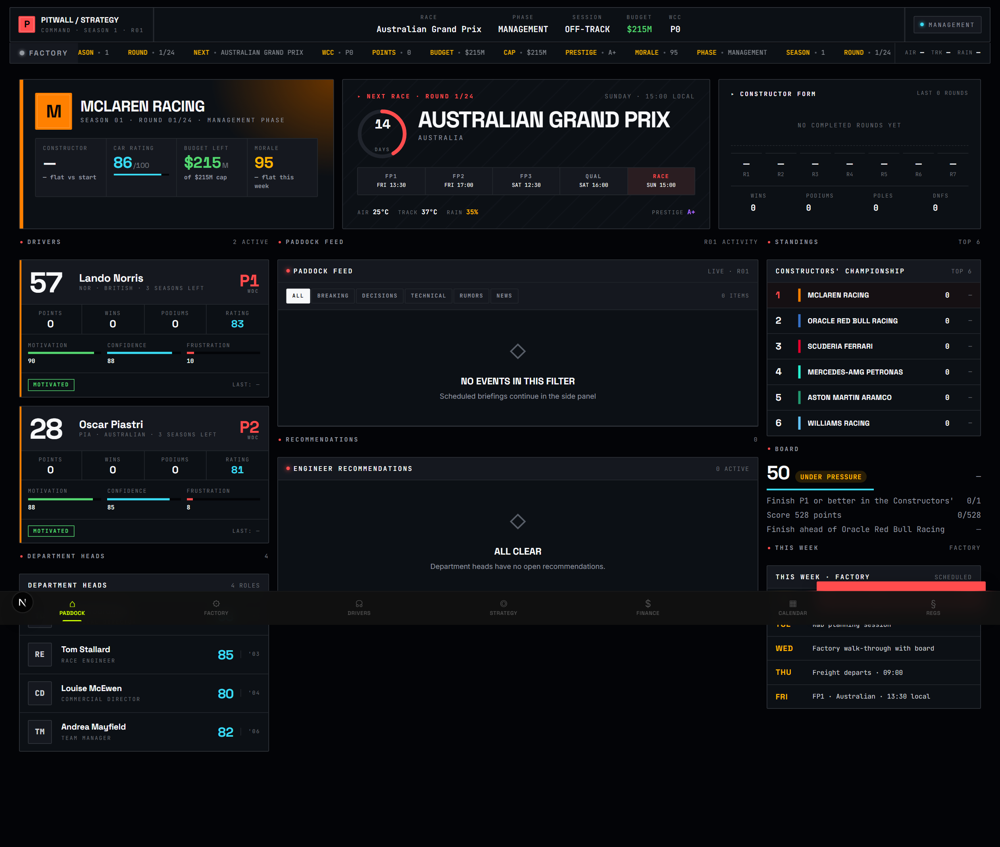

### 4. The Factory — R&D Command

Manage car development across a multi-tier tech tree (**Chassis · Power Unit · Active Aero**), allocate wind-tunnel and CFD hours under FIA limits, track power-unit component allocation, and run your pit-crew roster.

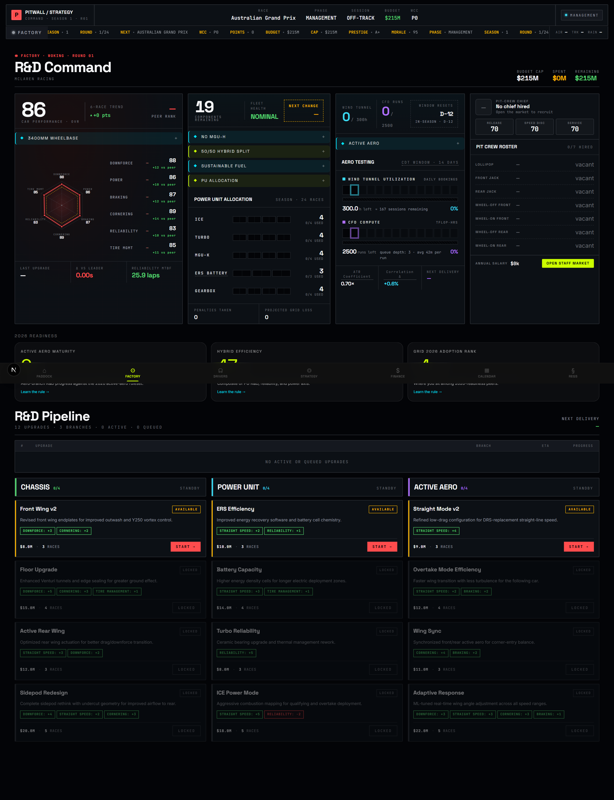

### 5. Driver Command

A full driver office: attribute radar (pace, racecraft, experience, mentality, marketability, potential), live **mood & head-state telemetry**, contract status with negotiation and release tools, season form, and a steward record.

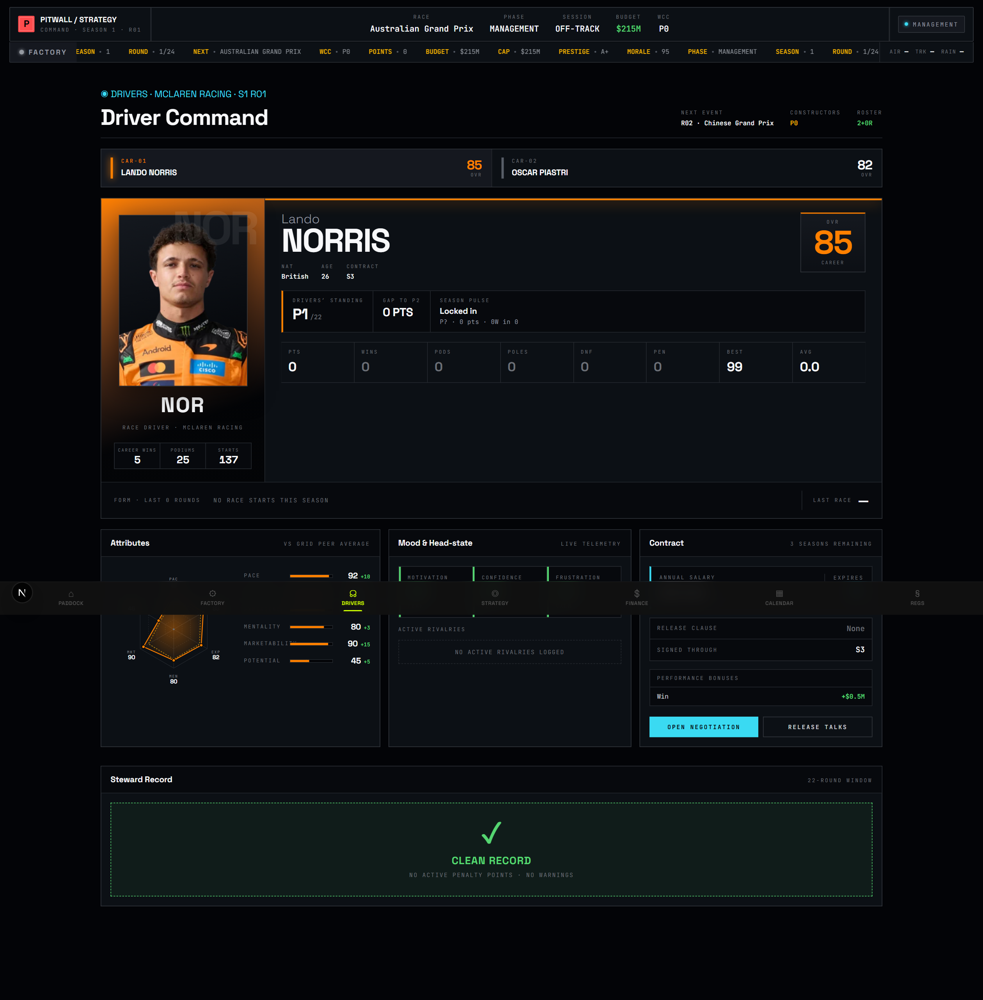

### 6. Financial HQ

Real-time **budget-cap** tracking against the FIA hard cap, a full **sponsorship system** with per-sponsor KPIs and banked bonuses, your **prestige rating** (A+ → F) with its contributing factors, and the season revenue summary.

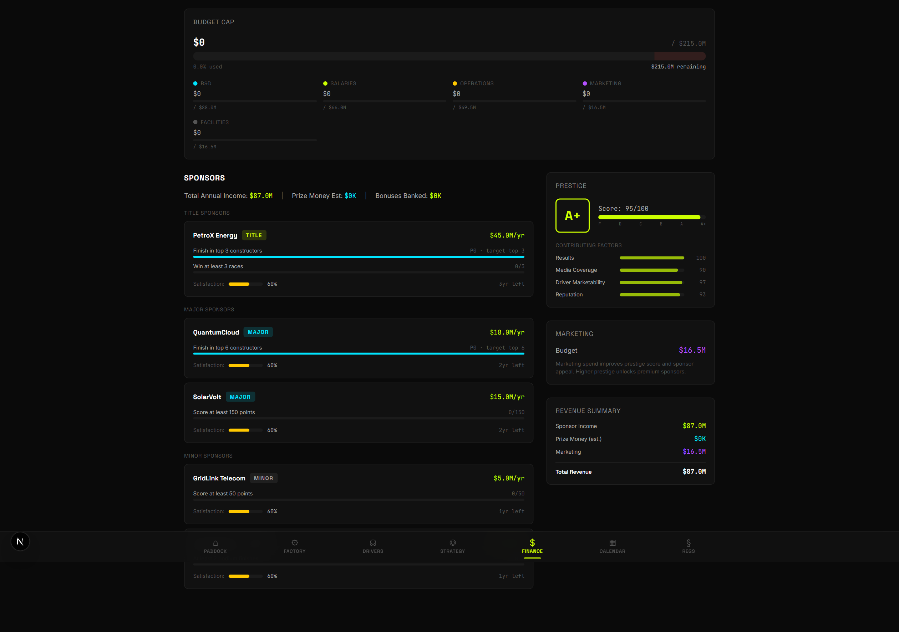

### 7. Season Calendar

The full season calendar with sprint weekends flagged, plus live constructor and driver standings.

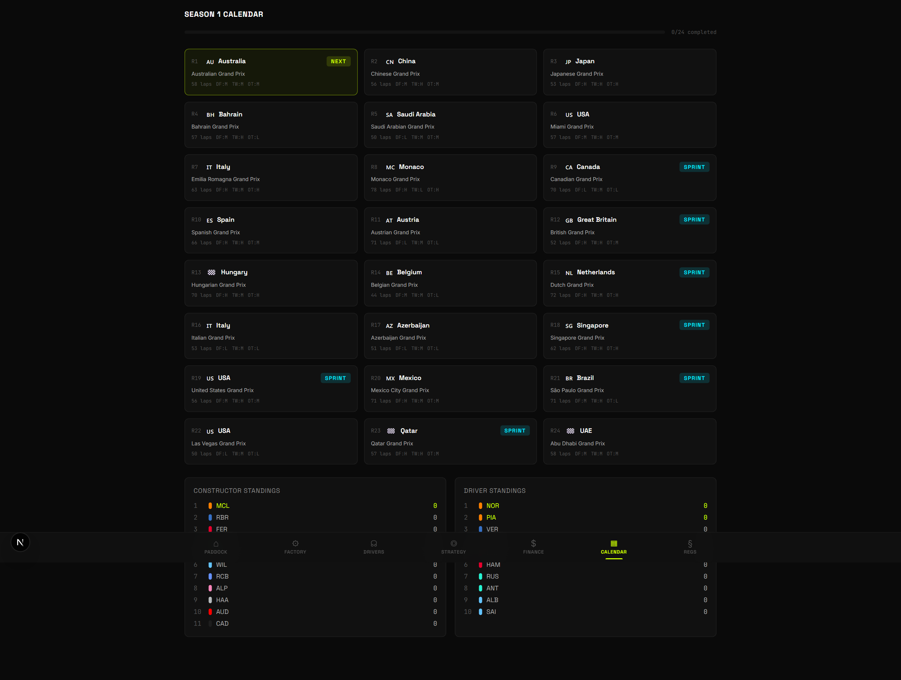

### 8. Regulations

Current technical and financial rules, the multi-season **regulation timeline**, and active **technical directives** that can shift car performance mid-season.

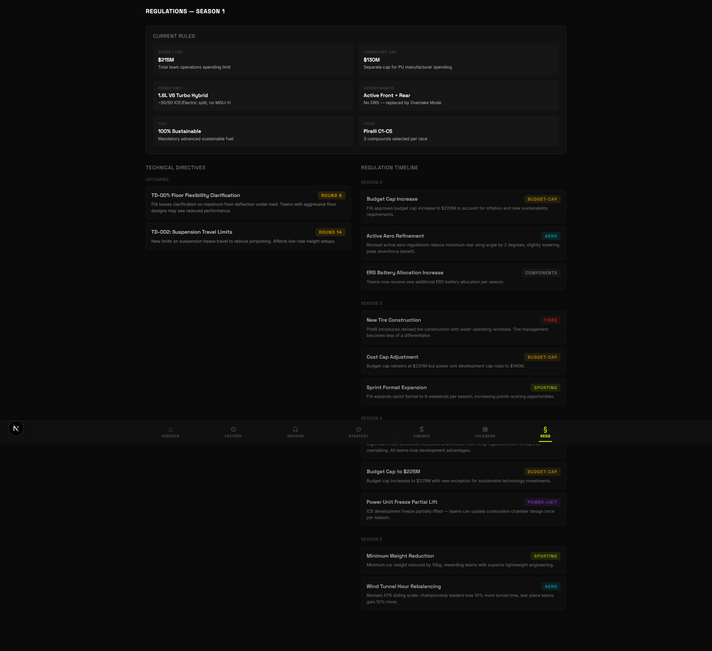

---

## Live Race Simulation

This is the heart of the game. When you commit to a race, the simulation runs lap-by-lap in a dedicated **Web Worker** and streams a full **broadcast view**: a live timing tower for all 20 cars, an animated circuit map with real car positions, tire-degradation curves, pit-strategy windows (undercut / overcut / optimum), driver commands, battle forecasts, stewards' decisions, and a live commentary + team-radio feed. You control sim speed (1× / 2× / 5× / MAX), pause, pit calls, and per-driver engine/tire modes in real time.

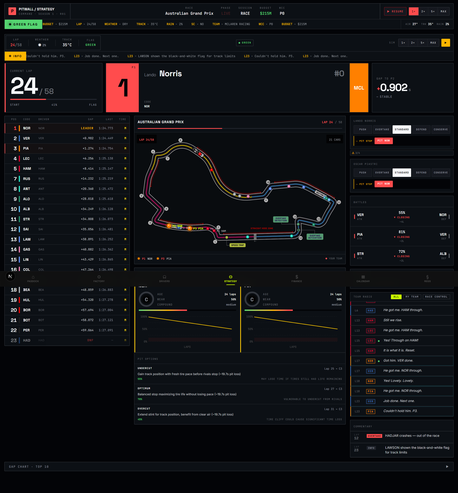

<table>
<tr>
<td width="50%" valign="top">

**Lights out.** Every race opens on the start gantry before the formation lap.

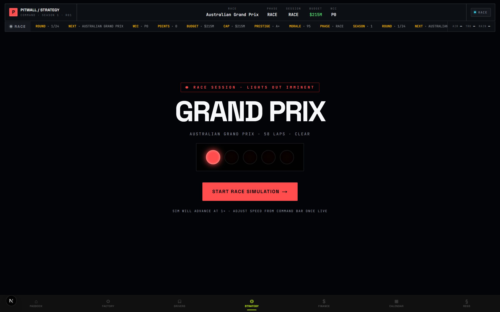

</td>
<td width="50%" valign="top">

**Pre-race setup.** Practice programs, qualifying, circuit intel, and the strategy planner before lights out.

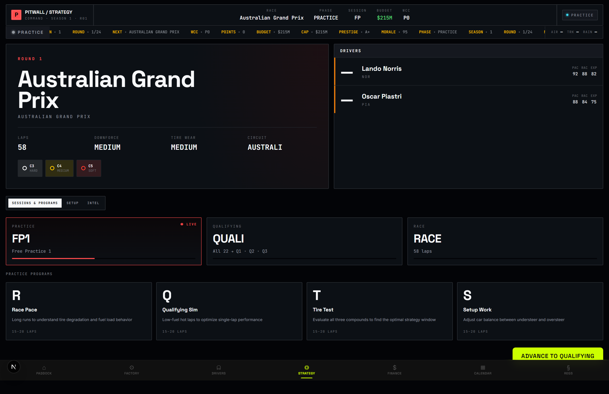

</td>
</tr>
</table>

**The chequered flag.** Full classification, points scored, fastest lap, podium, and the stewards' final penalty ledger — then back to management.

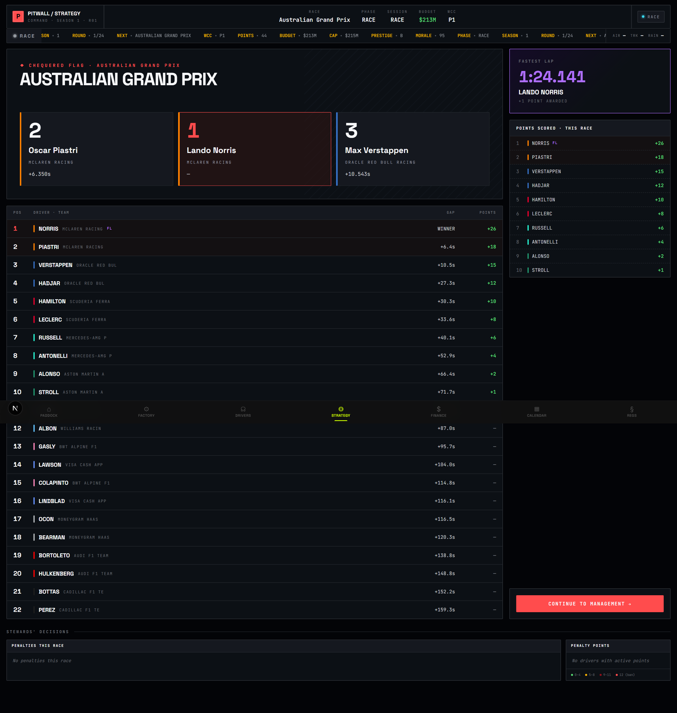

### What the race engine actually models

- **Lap-accurate physics** — pace derived from car performance, driver attributes, tire state, fuel load, and per-circuit calibration.
- **Tire model** — C1–C5 Pirelli compounds with real degradation curves, temperature and driving-style effects, and a mandatory compound change.
- **Pit strategy** — undercut / overcut / optimum windows, calibrated per-circuit pit-loss, and crew-rating-dependent stop times.
- **Weather FSM** — dry → damp → wet transitions with changing conditions.
- **Safety cars & cautions** — a full flag FSM (green / yellow / VSC / SC / red / chequered) driven by a caution arbiter that biases response to incident severity (a heavy shunt triggers a full Safety Car).
- **Incidents & DNFs** — world-driven crash and mechanical retirements on a separate per-lap PRNG.
- **Stewards & penalties** — track-limits strikes, contested-event fault evaluation, rejoin collisions, pit-lane offences, time penalties, grid drops, and bans — with live investigations and a post-race decisions panel.
- **Team radio & commentary** — context-aware, championship-aware radio and a streaming commentary ticker.
- **Determinism** — given the same seed, a race is byte-for-byte reproducible.

---

## Feature Deep Dive

<details>
<summary><strong>🏎️ Engineering & R&D</strong></summary>

- Multi-tier tech tree: **Chassis** (front/rear wing, floor/diffuser, sidepods, suspension), **Power Unit** (ICE, ERS/battery, turbo, recovery efficiency), and **Active Aero** (straight-mode / overtake-mode).
- Aerodynamic testing: **wind-tunnel hour** allocation and **CFD** runs under FIA-regulated limits, with high-downforce vs. low-drag development paths.
- Power-unit **component lifecycle**: allocation limits, grid penalties for exceeding them, and a reliability-vs-performance trade-off.
- Derived **car-performance** metrics surfaced as a radar, plus a live R&D pipeline.

</details>

<details>
<summary><strong>👤 Driver Management</strong></summary>

- Six-attribute model: **pace, racecraft, experience, mentality, marketability, development potential** — young drivers improve over seasons.
- Dynamic **mood & morale**: motivation, confidence, and frustration shift with results, car competitiveness, team treatment, and rivalry — and feed back into on-track mistakes and feedback quality.
- **Contracts**: salary negotiation against the cap, contract length, counter-offers, performance clauses, release talks with severance, and free-agent signing.
- **Scouting & poaching**: talent pipeline, procedurally-generated staff, and AI teams that can target your drivers (and vice versa).

</details>

<details>
<summary><strong>💰 Finance & Sponsorship</strong></summary>

- **Budget cap** tracking against the 2026 FIA hard cap with overspend consequences.
- Revenue streams: constructors' prize money, sponsorship tiers (title / major / minor), and marketing.
- **Sponsor KPIs**: each sponsor sets machine-readable targets (finishing positions, points, etc.); meeting them banks bonuses, missing them risks departure and auto-backfill.
- **Prestige rating** (A+ → F) driven by results, media coverage, driver marketability, and reputation — it gates which sponsors are available to you.

</details>

<details>
<summary><strong>📰 The Paddock & Politics</strong></summary>

- **Paddock rumor feed** — AI-generated transfer gossip, technical leaks, and team drama.
- **Press conferences & media management** — responses shape your team image.
- **Regulations & technical directives** — multi-season rule evolution that reshapes the car.
- **Board objectives** — a 3-objective season mandate with a live confidence meter and a retain → warning → **sack** escalation. This is the game's first real failure state.

</details>

---

## The 2026 Grid

All 11 constructors and 22 drivers are modelled on the real 2026 Formula 1 grid.

| Team | Driver 1 | Driver 2 | Power Unit |
|------|----------|----------|------------|
| 🟠 McLaren Racing | Lando Norris | Oscar Piastri | Mercedes |
| 🔵 Oracle Red Bull Racing | Max Verstappen | Isack Hadjar | Red Bull |
| 🔴 Scuderia Ferrari | Charles Leclerc | Lewis Hamilton | Ferrari |
| 🟢 Mercedes-AMG Petronas | George Russell | Kimi Antonelli | Mercedes |
| 🟢 Aston Martin Aramco | Fernando Alonso | Lance Stroll | Honda |
| 🔵 Williams Racing | Alex Albon | Carlos Sainz | Mercedes |
| 🔵 Visa Cash App Racing Bulls | Liam Lawson | Arvid Lindblad | Red Bull |
| 🩷 BWT Alpine F1 Team | Pierre Gasly | Franco Colapinto | Renault |
| ⚪ MoneyGram Haas F1 Team | Esteban Ocon | Oliver Bearman | Ferrari |
| 🔴 Audi F1 Team | Nico Hulkenberg | Gabriel Bortoleto | Audi |
| ⚪ Cadillac F1 Team | Valtteri Bottas | Sergio Perez | Ferrari |

---

## Starting Scenarios

| Scenario | Difficulty | Premise | Available Teams |
|----------|-----------|---------|-----------------|
| **Golden Era** | Easy | Inherit a championship-contending team at its peak — maintain dominance as rivals close in. | McLaren, Red Bull, Ferrari, Mercedes |
| **The Rebuild** | Medium | A once-great team has fallen. Outdated facilities, unhappy sponsors, proud legacy — bring them back. | Williams, Alpine, Aston Martin |
| **New Entrant** | Hard | A brand-new constructor. No history, no rivals, no excuses — everything from scratch. | Cadillac, Audi |
| **Crisis Management** | Extreme | Budget-cap breach, driver revolt, sponsor exodus. One season to save the team from collapse. | Scenario-gated |

Each scenario adjusts your starting budget, car performance, morale, prestige, and — crucially — the **board's expectations**.

---

## The Race Weekend Loop

```
        ┌─────────────────────── MANAGEMENT ───────────────────────┐
        │  R&D · Contracts · Sponsors · Facilities · Paddock news   │
        └─────────────────────────────┬─────────────────────────────┘
                                       ▼
   PRACTICE  ──►  QUALIFYING  ──►  RACE (live sim)  ──►  POST-RACE  ──► back to MANAGEMENT
   (programs)     (grid set)       (strategy + react)    (results,        (morale, budget,
                                                          penalties)        standings)
```

The game phase is a strict finite-state machine. **Sprint weekends** swap in Sprint Qualifying + a 100 km Sprint. At **season end**: final standings and prize money, contract renewals and the driver market, regulation changes, and an R&D reset for the new season — plus the board's verdict on whether you kept your job.

---

## Architecture

The codebase is built around one non-negotiable invariant: **the simulation engine is pure**.

```
src/engine/**     Pure functions. No side effects, no browser APIs, seeded PRNG.
                  Accept state + PRNG → return new state. Trivially unit-testable.
src/data/**       Static 2026 season data + OpenF1-calibrated circuit profiles (read-only).
src/workers/**    Web Worker + typed message protocol — the authoritative race loop.
src/stores/**     Zustand. A thin dispatch layer; all gameplay logic lives in the orchestrator.
src/hooks/**      React hooks. Adapters between store and UI. No game logic.
src/components/** React components. Read from the store via useShallow selectors.
src/app/**        Next.js App Router pages (Server + Client components).
```

**Key design decisions:**

- 🎲 **Deterministic by seed.** Every random outcome flows through a single seeded PRNG (`src/engine/core/prng.ts`). `Math.random()` is banned in the engine. Same seed → identical season.
- 🧵 **Race authority lives in a Web Worker.** The race loop runs off the main thread; the UI reads an interpolated 60 fps presentation layer through a single adapter. The worker protocol is fully typed and JSON-round-trip-safe.
- 💾 **Disciplined persistence boundary.** Only `gameStore.world` is saved to IndexedDB; live race runtime is session-scoped and never persisted. A versioned **schema-migration** system (currently **v15**) upgrades old saves on load.
- 🧱 **JSON-serializable state.** The entire game state is plain objects and arrays — no class instances, `Date`, `Map`, or `Set` — so it serializes cleanly at all times.
- 🔒 **Strict layer boundaries.** Components never import engine logic; stores never contain game logic; the engine never touches a browser API. These rules are enforced by review and dependency analysis.

---

## Tech Stack

| Layer | Technology |
|-------|-----------|
| Framework | **Next.js 16** (App Router) + **React 19** |
| Language | **TypeScript 5** (strict mode) |
| Styling | **Tailwind CSS 4** + a custom "Kinetic Command" design-token system |
| State | **Zustand 5** (with `useShallow` selectors) |
| Animation | **Framer Motion 12** (transform/opacity only) |
| Charts | **Recharts 3** (radar, degradation, gap, timeline) |
| Persistence | **IndexedDB** via `idb` 8 — no backend |
| Simulation | Pure TypeScript engine in a **Web Worker** |
| Testing | **Vitest 4** + Testing Library + `fake-indexeddb` |
| Data | **OpenF1**-calibrated circuit/tire/pit profiles |

---

## Getting Started

### Prerequisites

- **Node.js 20+** (developed on Node 24)
- npm (ships with Node)

### Install & Run

```bash
# clone
git clone https://github.com/squallexe12/f1-manager.git
cd f1-manager

# install dependencies
npm install

# start the dev server
npm run dev
```

Open **[http://localhost:3000](http://localhost:3000)** and click **New Game**. Saves persist automatically to your browser's IndexedDB — use **Continue** / **Load Game** from the title screen to resume.

### Other scripts

```bash
npm run build        # production build
npm start            # serve the production build
npm run lint         # ESLint (eslint-config-next)
npm run sync:openf1  # re-sync circuit calibration data from OpenF1

npx vitest run       # run the full test suite
npx vitest run tests/engine   # run just the engine tests
npx tsc --noEmit     # type-check
```

---

## Project Structure

```
f1-simulation/
├── src/
│   ├── app/             # Next.js App Router pages (paddock, factory, drivers,
│   │                    #   strategy, finance, calendar, regulations, new-game)
│   ├── components/      # 89 React components, grouped by domain
│   │   ├── layout/      #   page shell, top bar, bottom nav
│   │   ├── strategy/    #   live-race broadcast UI (timing tower, circuit map…)
│   │   ├── factory/ drivers/ finance/ menu/ charts/ ui/
│   ├── engine/          # 70 pure simulation modules
│   │   ├── core/        #   orchestrator, state-manager (FSM), prng, save-system
│   │   ├── race/        #   race simulator, tire model, overtakes, penalties
│   │   ├── engineering/ finance/ driver/ narrative/ regulation/ ai/
│   ├── workers/         # race-sim-worker + typed protocol
│   ├── stores/          # Zustand stores (thin dispatch) + persistence setup
│   ├── hooks/           # store↔UI adapters (use-race-simulation, use-save-game…)
│   ├── data/            # 2026 teams, drivers, circuits, scenarios, sponsors,
│   │                    #   R&D tree, regulations, OpenF1 calibration
│   └── types/           # shared TypeScript types (FullGameState, race protocol)
├── tests/               # 1,000+ Vitest cases across 132 files
├── scripts/openf1/      # OpenF1 data-sync pipeline
└── public/              # circuit maps, team & driver assets
```

---

## Testing & Quality

Quality is enforced layer-by-layer:

- **1,082 test cases across 132 files** covering the engine, data, stores, hooks, and components.
- **Engine tests** exercise pure functions directly — no mocking of internals.
- **Persistence tests** use `fake-indexeddb`; **worker tests** drive the message handler directly.
- **Determinism tests** run a seeded race twice and assert byte-identical output — mandatory for any change to the race engine.
- **TypeScript strict mode** everywhere; a clean `tsc --noEmit` is a hard gate. No `@ts-ignore` / `as any` escapes to make tests pass.

---

## Design System — "Kinetic Command"

A dark, telemetry-inspired aesthetic that makes every screen feel like a high-tech pit wall.

| Token | Value |
|-------|-------|
| Background | Deep blacks / dark grays |
| Accent — Lime | `#CCFF00` |
| Accent — Cyan | `#00E5FF` |
| Headings | **Space Grotesk** |
| Body | **Inter** |
| Surfaces | Glassmorphic cards, layered depth |
| Motion | Purposeful micro-animations — `transform` & `opacity` only, no `transition-all` |

The interface follows **progressive disclosure** (Glance → Detail → Deep Dive) and is built mobile-friendly on a desktop-first broadcast layout, with keyboard navigation and WCAG-minded contrast.

---

## Roadmap & Status

**Current status: MVP v0.1.0** — single-player season mode, the full grid, the live race engine, and all management surfaces are playable end-to-end.

<details>
<summary><strong>Implementation phases shipped</strong></summary>

| Phase | Description |
|-------|-------------|
| IP-01–05 | Deterministic bootstrap · command authority · worker protocol · authoritative worker rollout · persistence hardening |
| IP-06–07 | OpenF1 real-data integration — tire/weather/overtake calibration, 24 circuit profiles, pit-loss & stint calibration, pre-race intel |
| IP-08 | Engineer recommendations |
| IP-09–10 | Race penalty system · press conferences & media management |
| IP-11 | 2026 regulations Factory wedge |
| IP-12–13 | Track-state offences (track limits, rejoin, flag breaches) · race incidents & safety-car realism |
| IP-14 | Board objectives & season expectations (live confidence + sack escalation) |

</details>

**Planned / future:** consequential practice & qualifying (grid from real session pace), F2/F3 scouting pipeline, multi-season story arcs, regulation voting, and (post-MVP) multiplayer/league mode and a backend.

---

## Disclaimer

This is an **unofficial, non-commercial fan project** built for learning and portfolio purposes. It is **not affiliated with, endorsed by, or associated with** Formula 1, the FIA, or any team, driver, or sponsor. All team names, driver names, and trademarks belong to their respective owners and are used here under fair use for a non-commercial simulation. The 2026 grid is based on publicly reported information and is used for illustrative gameplay only.

---

<div align="center">

**Built with TypeScript, a pure simulation engine, and a lot of telemetry.**

*Lights out and away we go.* 🏎️💨

</div>
