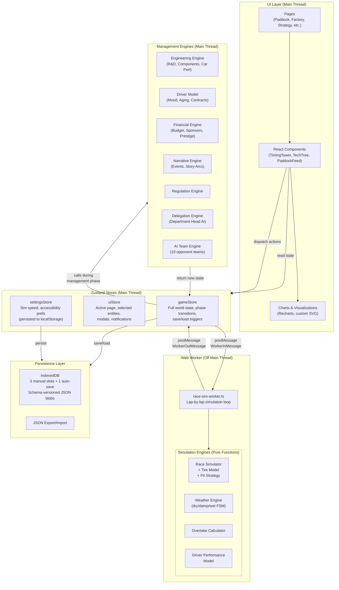

# ADR-001: System Architecture for Mission Control: F1 Kinetic Command

**Date:** 2026-04-04
**Status:** Proposed
**Authors:** Architecture Review
**Spec:** `docs/superpowers/specs/2026-04-04-mission-control-design.md`
**Plan:** `docs/superpowers/plans/2026-04-04-mission-control-implementation.md`

---

## 1. System Architecture Diagram



### Key Boundaries

- **Main thread** owns all UI rendering, Zustand stores, management-phase engines, and worker communication.
- **Web Worker** owns the race simulation loop exclusively. No DOM access, no store access. Communication is message-only.
- **Engines are pure functions.** They accept state and a seeded PRNG, return new state. No side effects. This is the single most important architectural invariant.
- **IndexedDB** is the sole durable storage. No localStorage for game state (avoids 5MB ceiling).

---

## 2. Critical Design Patterns

### 2.1 State Machine -- Game Phase Transitions

The `Phase` type (`management | practice | sprint-qualifying | sprint | qualifying | race | post-race | season-end`) forms a finite state machine.

**Recommendation:** Implement a strict transition map as a lookup object. Validate every `advancePhase()` call against it. Log or throw on invalid transitions during development.

```
management -> practice -> qualifying -> race -> post-race -> management
                       -> sprint-qualifying -> sprint -> qualifying (sprint weekends)
post-race (round 22) -> season-end -> management (new season)
```

### 2.2 Observer -- Race Lap Updates

The Worker-to-UI communication is inherently an observer pattern. The game store subscribes to worker messages and fans out to React components via Zustand selectors.

**Recommendation:** Components subscribe to narrow selectors (e.g., `useGameStore(s => s.raceState.tireStates)`) to avoid unnecessary re-renders.

### 2.3 Strategy Pattern -- AI Team Decisions

Each AI team has a personality profile. The same decision must produce different outcomes per team personality.

**Recommendation:** Model AI decision functions as strategy objects that accept team personality + world state and return a decision.

### 2.4 Command Pattern -- Driver Commands During Race

Commands are naturally serializable (they cross the worker boundary as JSON), can be logged for replay, and can be queued while paused.

### 2.5 Rule Engine -- Narrative Event Generation

Keep conditions as pure predicate functions `(state: GameState) => boolean`. Keep templates as data, not code. This separation makes adding new narrative content a data task, not an engineering task.

### 2.6 Mediator -- Game Store as Central Hub

The game store acts as mediator between all engines and all UI components. No engine talks to another engine directly. No component talks to a worker directly. Everything flows through the store.

---

## 3. Performance Considerations

### 3.1 Message Batching at MAX Speed

**Risk:** At MAX speed, the worker floods the main thread with messages, causing UI freeze.

**Mitigation:**
- At 1x/2x/5x: post one `lapUpdate` per tick interval (2s / 1s / 0.4s).
- At MAX: batch 5 laps per message. UI animates through them sequentially using `requestAnimationFrame`.
- Backpressure: main thread sends `ack` after processing each batch. Worker waits for ack before next batch.

### 3.2 Zustand Selector Granularity

- Split store into logical slices: `gameMetaSlice`, `teamsSlice`, `raceSlice`, `narrativeSlice`, `financeSlice`.
- Components must always use narrow selectors.
- Use `shallow` equality from Zustand for object selectors.

### 3.3 Rendering During Race Phase

- Virtualize commentary feed if it exceeds ~50 entries.
- Use CSS `will-change: transform` on timing tower rows.
- Debounce non-critical UI updates (battle forecast) to every 2 laps at high speeds.

### 3.4 Engine Computation Cost

Management-phase engines run synchronously on main thread. Well under 16ms for 11 teams. Monitor and consider a second worker only if measured >16ms.

---

## 4. State Management Architecture

### 4.1 Store Structure

```
gameStore (Zustand)
├── meta: { season, currentRound, phase, playerTeamId, scenario, seed }
├── teams: Record<string, TeamState>
├── drivers: Record<string, DriverState>
├── calendar: Race[]
├── narrative: { events, activeArcs, feed }
├── race: RacePhaseState | null
│   ├── currentLap, totalLaps, weather, safetyCar
│   ├── timingTower: LapResult[]
│   ├── tireStates: Record<driverId, TireState>
│   ├── commentary: CommentaryEntry[]
│   └── playerCommands: Record<driverId, DriverCommand>
├── actions: { initGame, advancePhase, allocateRnD, ... }
└── computed: { playerTeam, playerDrivers, standings }
```

### 4.2 State Ownership Boundary

| State | Owner |
|-------|-------|
| Full world state (teams, drivers, standings, R&D, finance) | `gameStore` on main thread |
| In-progress race simulation | Web Worker (internal) |
| Race display state (timing tower, tire viz, commentary) | `gameStore.race` slice |
| UI navigation, selection, modals | `uiStore` |
| User preferences | `settingsStore` |

### 4.3 Data Flow: Worker to UI

1. Player clicks "Start Race" → gameStore serializes state → posts `start` to worker
2. Worker computes lap N → posts `lapUpdate` → gameStore applies update → React renders
3. Player clicks "Push" → gameStore posts `command` to worker → applied next lap tick
4. Worker posts `raceEnd` → gameStore.completeRace() → phase transition

### 4.4 Serialization Rule

Everything in `gameStore` (except `actions` and `computed`) must be JSON-serializable at all times. No class instances, no functions, no circular references. All cross-entity references use string IDs.

---

## 5. Testing Strategy

### 5.1 Unit Tests -- Simulation Engines (Highest Priority)

All engines are pure functions — trivially testable with zero mocking.

**Critical test:** Run a full 5-race season with a fixed seed twice. Assert byte-identical results. Catches any accidental non-determinism.

### 5.2 Integration Tests -- State Transitions

Test `advancePhase()` orchestration: management→practice triggers delegation, narrative, R&D. Race→post-race updates standings, morale, sponsors. Use `fake-indexeddb`.

### 5.3 Component Tests

React Testing Library with mock Zustand stores. Focus on: TimingTower ordering, PaddockFeed color coding, TechTree unlock logic, DriverCommands dispatch.

### 5.4 Worker Tests

Mock `postMessage` / `onmessage` harness. Verify start/pause/resume/command/raceEnd message flow.

---

## 6. Scalability for Phase 2+

### 6.1 Multiplayer Readiness

- Keep engines browser-agnostic (no DOM, no `window`, no `localStorage` in `src/engine/`).
- Seeded PRNG enables server-side race replay for validation.
- `SerializableGameState` type is the leaderboard submission format.

### 6.2 Narrative Content Expansion

- Event templates in `src/data/events/` as pure data files.
- Template ID system for save compatibility across content updates.

### 6.3 Custom Team Creation

- Never hardcode team count. Use `Object.keys(teams).length`.
- Team IDs are opaque strings, not array indices.
- No team-specific logic in engines.

### 6.4 Save Schema Migration

- Migrations are pure functions kept forever.
- Test: load v1 fixture → run full pipeline → verify current schema.

### 6.5 Mobile Layout

- Consistent `page-shell.tsx` wrapper for responsive breakpoints.
- Strategy Room components as independent composable panels.
- No fixed pixel widths.

---

## 7. Open Questions

| # | Question | Recommendation |
|---|----------|---------------|
| 1 | Sync or async management engines? | Start sync. Profile after implementation. Move to worker only if >16ms. |
| 2 | Multi-season save size growth? | Cap stored history: last 3 seasons detailed, older summarized. |
| 3 | Regular or Shared Worker? | Regular Worker + singleton hook. SPA shell preserves lifetime across route changes. |
| 4 | Browser tab sleep/throttle? | Auto-pause simulation on `visibilitychange` hidden. Resume on return. |

---

## 8. Decision Summary

| Decision | Choice | Confidence |
|----------|--------|------------|
| Race sim in Web Worker, management on main thread | Confirmed | High |
| Zustand with slice pattern and narrow selectors | Confirmed | High |
| Message batching with backpressure at MAX speed | New | High |
| Pure-function engines with seeded PRNG | Confirmed | High |
| IndexedDB-only persistence with schema migration | Confirmed | High |
| Strict phase transition state machine | New | High |
| Browser-agnostic engines for server portability | New | Medium |
| Defer management worker until profiling shows need | New | Medium |
