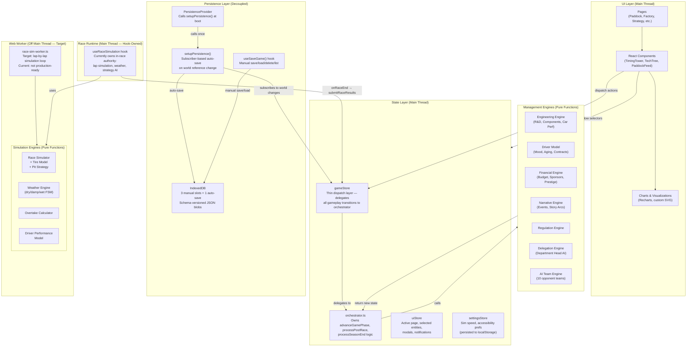

# ADR-001: System Architecture for Mission Control: F1 Kinetic Command

**Date:** 2026-04-04 (updated 2026-04-11)
**Status:** Accepted
**Authors:** Architecture Review
**Spec:** `docs/superpowers/specs/2026-04-04-mission-control-design.md`
**Plan:** `docs/superpowers/plans/2026-04-04-mission-control-implementation.md`

---

## 1. System Architecture Diagram



### Key Boundaries

- **Main thread** owns all UI rendering, Zustand stores, management-phase engines, and race simulation (via `useRaceSimulation` hook).
- **`game-store.ts`** is a thin dispatch layer. It holds `world`, `eventCooldowns`, `lastRaceResults`, and `lastSeasonEnd` but delegates all gameplay state transitions to `orchestrator.ts`.
- **`orchestrator.ts`** owns the pure gameplay flow: `advanceGamePhase()`, `processPostRacePhase()`, `processSeasonEndPhase()`, and `processManagementEntry()`.
- **Persistence** is fully decoupled from the store. Auto-save runs via a Zustand subscriber wired by `setupPersistence()`. Manual save/load flows through `useSaveGame()` hook. Both use a shared `SaveSystem` singleton.
- **In-race authority** currently lives in the `useRaceSimulation` hook on the main thread, not in the Web Worker. The worker (`race-sim-worker.ts`) exists but is not production-ready.
- **Engines are pure functions.** They accept state and a seeded PRNG, return new state. No side effects. This is the single most important architectural invariant.
- **IndexedDB** is the sole durable storage. No localStorage for game state (avoids 5MB ceiling).
- **UI components** use `useShallow` selectors from Zustand to minimize re-render blast radius.

---

## 2. Critical Design Patterns

### 2.1 State Machine -- Game Phase Transitions

The `Phase` type (`management | practice | sprint-qualifying | sprint | qualifying | race | post-race | season-end`) forms a finite state machine.

Transition logic lives in `state-manager.ts:advancePhase()`, called by `orchestrator.ts:advanceGamePhase()` which additionally triggers management entry processing when transitioning into management phase.

```
management -> practice -> qualifying -> race -> post-race -> management
                       -> sprint-qualifying -> sprint -> qualifying (sprint weekends)
post-race (round 22) -> season-end -> management (new season)
```

### 2.2 Orchestrator Pattern -- Gameplay Flow

The `orchestrator.ts` module acts as the central coordinator for all non-race gameplay transitions:

- **`advanceGamePhase()`**: Calls `advancePhase()` for the state machine transition, then runs management entry processing if entering management phase.
- **`processManagementEntry()`**: Processes R&D cycles, technical directives, and AI team decisions.
- **`processPostRacePhase()`**: Updates standings, moods, finance, and narrative events after a race.
- **`processSeasonEndPhase()`**: Processes prizes, aging, contracts, R&D reset, and advances the season counter.

All orchestrator functions are pure — they accept state and return new state with no side effects.

### 2.3 Observer -- Race Lap Updates

The race simulation currently uses a React hook (`useRaceSimulation`) with `setTimeout`-based tick scheduling. Each tick simulates one lap and updates React state. Sub-tick interpolation runs via `requestAnimationFrame` for smooth car position animation.

**Target architecture:** Worker-to-UI communication via `postMessage`, with the game store subscribing to worker messages. Components would read via narrow Zustand selectors.

### 2.4 Strategy Pattern -- AI Team Decisions

Each AI team has a personality profile (`aggressiveness`, `financialDiscipline`, `driverFocus`). The `processAllAITeams()` function in `ai-team-engine.ts` produces different outcomes per team personality.

### 2.5 Command Pattern -- Driver Commands During Race

`setDriverCommand` in the store is currently a placeholder. During race simulation, commands are managed directly by the `useRaceSimulation` hook via `sendCommand()` and `pitWithCompound()`.

### 2.6 Rule Engine -- Narrative Event Generation

Conditions are pure predicate functions `(state: GameState) => boolean`. Templates are data, not code.

### 2.7 Mediator -- Game Store as Central Hub

The game store acts as mediator between orchestrator, engines, and UI components. No engine talks to another engine directly. No component talks to a worker directly. Everything flows through the store (for management) or through the race hook (for in-race).

---

## 3. Performance Considerations

### 3.1 Message Batching at MAX Speed

**Risk:** At MAX speed, the hook floods React state updates, causing UI freeze.

**Current mitigation:**
- At 1x/2x/5x: one `simulateNextLap()` call per tick interval (2s / 1s / 0.4s).
- At MAX: 50ms tick interval.
- Sub-tick car position interpolation runs at 60fps via `requestAnimationFrame`, synced to React state every 100ms.

### 3.2 Zustand Selector Granularity

- Components use `useShallow` selectors to subscribe to only the fields they need.
- Custom `useGameSlice` hook provides pre-built selector patterns for common page needs.

### 3.3 Rendering During Race Phase

- Virtualize commentary feed if it exceeds ~50 entries.
- Use CSS `will-change: transform` on timing tower rows.
- Debounce non-critical UI updates (battle forecast) to every 2 laps at high speeds.

### 3.4 Engine Computation Cost

Management-phase engines run synchronously on main thread via orchestrator. Well under 16ms for 11 teams.

---

## 4. State Management Architecture

### 4.1 Store Structure

```
gameStore (Zustand) — thin dispatch layer
├── world: FullGameState | null
│   ├── gameState: { season, currentRound, phase, playerTeamId, scenario, seed, totalRaces }
│   ├── teams: Team[]
│   ├── drivers: Driver[]
│   ├── calendar: Race[]
│   ├── finance: Record<string, FinanceState>
│   ├── narrativeEvents: NarrativeEvent[]
│   └── storyArcs: StoryArc[]
├── eventCooldowns: Record<string, number>
├── lastRaceResults: RaceResult[] | null
├── lastSeasonEnd: SeasonEndResult | null
└── actions: { initGame, advancePhase, submitRaceResults, processSeasonEnd,
               allocateRnD, pauseRnD, setDriverCommand, resolveEvent }
```

### 4.2 State Ownership Boundary

| State | Owner | Notes |
|-------|-------|-------|
| Full world state (teams, drivers, standings, R&D, finance) | `gameStore` on main thread | Via `orchestrator.ts` pure functions |
| In-progress race simulation | `useRaceSimulation` hook (main thread) | **Current**: hook-owned. **Target**: Web Worker |
| Race display state (timing, tires, commentary, car positions) | `useRaceSimulation` hook local state | React state, not in Zustand store |
| UI navigation, selection, modals | `uiStore` | |
| User preferences | `settingsStore` | localStorage |
| Persistence (auto-save) | `setupPersistence()` subscriber | Decoupled from store actions |
| Persistence (manual save/load) | `useSaveGame()` hook | Reads store imperatively via `getState()` |

### 4.3 Data Flow: Race Lifecycle

1. Player clicks "Start Race" → `useRaceSimulation.startRace()` initializes local sim state from store data
2. Hook computes lap N via `simulateLap()` → updates local React state → RAF interpolates car positions
3. Player clicks "Push" → `sendCommand()` updates hook-internal strategy state
4. Race ends → hook calls `onRaceEnd` callback → store's `submitRaceResults()` → `processPostRacePhase()` via orchestrator

### 4.4 Serialization Rule

Everything in `gameStore.world` must be JSON-serializable at all times. No class instances, no functions, no circular references. All cross-entity references use string IDs.

---

## 5. Testing Strategy

### 5.1 Unit Tests -- Simulation Engines (Highest Priority)

All engines are pure functions — trivially testable with zero mocking.

**Critical test:** Run a full 5-race season with a fixed seed twice. Assert byte-identical results. Catches any accidental non-determinism.

### 5.2 Integration Tests -- State Transitions

Test `advanceGamePhase()` orchestration: management→practice triggers delegation, narrative, R&D. Race→post-race updates standings, morale, sponsors. Use `fake-indexeddb`.

### 5.3 Characterization Tests -- Orchestrator

Direct tests for `advanceGamePhase()`, `processPostRacePhase()`, `processSeasonEndPhase()` in `tests/engine/core/orchestrator.test.ts`. Verify pure function behavior: no input mutation, deterministic output.

### 5.4 Component Tests

React Testing Library with mock Zustand stores. Focus on: TimingTower ordering, PaddockFeed color coding, TechTree unlock logic, DriverCommands dispatch.

### 5.5 Worker Tests

Mock `postMessage` / `onmessage` harness. Verify start/pause/resume/command/raceEnd message flow. (Deferred until worker is production-ready.)

---

## 6. Scalability for Phase 2+

### 6.1 Multiplayer Readiness

- Keep engines browser-agnostic (no DOM, no `window`, no `localStorage` in `src/engine/`).
- Seeded PRNG enables server-side race replay for validation.
- `FullGameState` type is the leaderboard submission format.

### 6.2 Narrative Content Expansion

- Event templates in `src/data/events/` as pure data files.
- Template ID system for save compatibility across content updates.

### 6.3 Custom Team Creation

- Never hardcode team count. Use `Object.keys(teams).length`.
- Team IDs are opaque strings, not array indices.
- No team-specific logic in engines.

### 6.4 Save Schema Migration

- Migrations are pure functions kept forever.
- Test: load v1 fixture → run full pipeline → verify current schema.

### 6.5 Mobile Layout

- Consistent `page-shell.tsx` wrapper for responsive breakpoints.
- Strategy Room components as independent composable panels.
- No fixed pixel widths.

---

## 7. Open Questions

| # | Question | Recommendation | Status |
|---|----------|---------------|--------|
| 1 | Sync or async management engines? | Start sync. Profile after implementation. Move to worker only if >16ms. | Confirmed sync — well under budget |
| 2 | Multi-season save size growth? | Cap stored history: last 3 seasons detailed, older summarized. | Open |
| 3 | Regular or Shared Worker? | Regular Worker + singleton hook. SPA shell preserves lifetime across route changes. | Open — worker not yet production-ready |
| 4 | Browser tab sleep/throttle? | Auto-pause simulation on `visibilitychange` hidden. Resume on return. | Open |

---

## 8. Decision Summary

| Decision | Choice | Confidence |
|----------|--------|------------|
| Race sim in Web Worker, management on main thread | Target — currently hook-owned | High |
| Zustand with useShallow selectors | Confirmed | High |
| Pure-function engines with seeded PRNG | Confirmed | High |
| IndexedDB-only persistence with schema migration | Confirmed | High |
| Strict phase transition state machine | Confirmed | High |
| game-store as thin dispatch, orchestrator owns flow | Confirmed (v1.0.1 refactor) | High |
| Persistence decoupled via subscriber pattern | Confirmed (v1.0.1 refactor) | High |
| Browser-agnostic engines for server portability | Confirmed | Medium |
| Defer management worker until profiling shows need | Confirmed | Medium |
